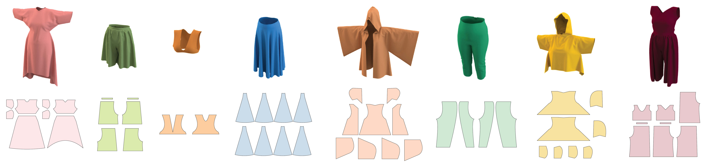

# Generating Datasets of 3D Garments with Sewing Patterns

Official implementation of [Generating Datasets of 3D Garments with Sewing Patterns](https://arxiv.org/abs/2109.05633) (accepted to NeurIPS 2021 Dataset and Benchmarks Track).

## Dataset

Using this data generator, we created a [Dataset of 3D Garments with Sewing patterns](https://doi.org/10.5281/zenodo.5267549) consisting of 19 garment types and more then 20 000 garment samples. 

> The dataset is available on Zenodo: https://doi.org/10.5281/zenodo.5267549.

If you have problems, questions, or suggestions regarding the dataset, please [open an issue](https://github.com/maria-korosteleva/Garment-Pattern-Generator/issues) with `dataset` label.

## Docs
Provided in `./docs` folder

* [Dependencies and Installation instructions](docs/Installation.md)
* [Configuring dataset generation](docs/Setting_up_generator.md) - from sewing pattern template to physics simulation components.
* [Running data generation](docs/Running_generation.md) - getting all the steps right & additional helpful operations.
* [Sewing pattern template specification](docs/template_spec_with_comments.json) - spec example with comments to all the elements.

## Citation

If you are using our system in your research, consider citing our paper

> Bibtex will be added here upon paper publication

## Contributions

We welcome contributions of bug fixes, features, and new assets (templates, scenes, body models, simulation properties). Please, create a [Pool Request](https://github.com/maria-korosteleva/Garment-Pattern-Generator/pulls) if you wish to contribute.

>☝ All the new code and assets will be shared here under the [MIT license](LICENSE). Please, ensure that you hold the rights to distribute your artifacts like that. The authors do not take the responsibility of licensing violations for artifacts contributed by users. Thank you for your understanding 😊

### ToDo (future work)
* Reformat template spec description for easy reading
* Allow to turn off or chose simpler renderer for getting the datasets faster
* Adding support for other curve types
* Body Pose variations
* Body Shape variations
* Fabric properties sampling
* Swithcing to Open Source cloth simulator

## Contact

For bug reports, feature suggestion, and code-related questions, please [open an issue](https://github.com/maria-korosteleva/Garment-Pattern-Generator/issues). 

For other inquires, contact the authors: 

* Maria Korosteleva ([mariako@kaist.ac.kr](mailto:mariako@kaist.ac.kr)) (Main point of contact). 

* Sung-Hee Lee ([sunghee.lee@kaist.ac.kr](mailto:sunghee.lee@kaist.ac.kr)).

## Attribution
We are using [SMPL](https://smpl.is.tue.mpg.de/) female average body model as base for [Body Model examples](data_generation/Bodies). [SMPL Body Model](https://smpl.is.tue.mpg.de/) is licensed under [CC BY 4.0](https://creativecommons.org/licenses/by/4.0/).
