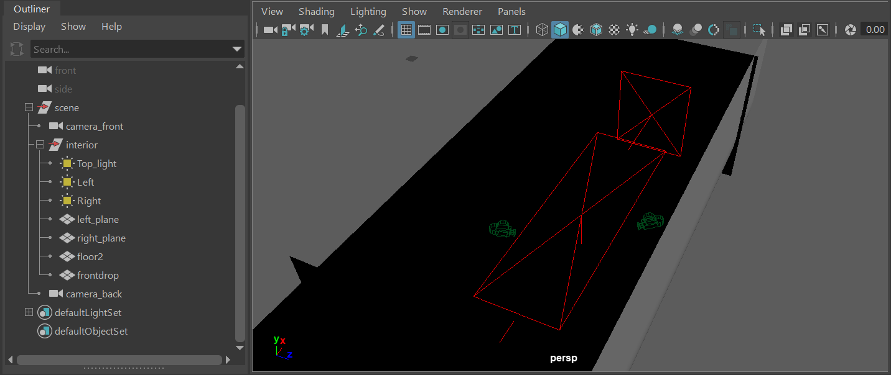

# Dataset setup components

In order to generate a new dataset of garments, you would need:
* [Sewing Pattern Template](#pattern-template)
* [Base body model](#body-model)
* [Simulation properties config](#simulation-config-file)
* (Optional) [Scan imitation properties config](#scan-imitation-configuration) (usually combined with Simulation props config)
* (Optional) [Maya Scene for rendering setup](#render-scene)

Examples of each component are provided in `./data_generation` subfolders. Any examples can be freely reused with proper attribution given. Note, that the provided human body model is part of [SMPL Body Model](https://smpl.is.tue.mpg.de/) that is licensed under [CC BY 4.0](https://creativecommons.org/licenses/by/4.0/).

## Preview your setup in GarmentViewer GUI

We provide simple UI for Maya for viewing a parametrized garment template, test parameter values, simulation and scan imiation processes & rendering setup.

To use it, simply run Autodesk Maya and copy the contents of `garmentviewer.py` to the Python scripting console.

Features:
* Loading sewing pattern spec as geometry
* Loading scene setup and simulation\scan imitation properties from external files
* Controlling parameters values (for parameters from spec) from the interface, including restoration of template state and drawing random samples
* Editing panels' global rotation and translation both from GarmentViewer or with native Maya tools
* Editing material properties for sim (native Qualoth tools)
* Running physics simulation on currently loaded garment.
* Testing the presence of collisions in garment mesh
* Visualing Segmentation labels
* Running scan imitation process
* Saving current garment with current parameter values, panel positions, garment mesh and chosen material properties with or without rendering images.

## Closer look at the setup components
### Pattern template
[`data_generation/Patterns`](../data_generation/Patterns) contains exmaples of parametrized pattern templates that can be sampled to form a dataset of sewing patterns. 
* Each template is a .json file that describes the structure of the base pattern and the way it could be changes (parametrization)
* [`docs/template_spec_with_comments.json`](../docs/template_spec_with_comments.json) gives a detailed description of the format used to describe pattern pemplates.

A development of a new pattern template is a mostly manual process. One should create and define a new .json file with description of the sewing pattern of base garment and specification of its parametrization. 

To ease this process, we recommend to
* Use one of the existing templates as a starting point.
* Use [GarmentViewer GUI](#Preview-your-setup-in-GarmentViewer-GUI) at every development step. It visualizes the current pattern and allows to test parameters and their ranges.

### Body model
[`data_generation/Bodies`](../data_generation/Bodies) contain example `.obj` files with 3D models used to drape a garment on
* One data generation run uses only one base model (at this stage of development)
* In general, our system allows to use any kind of  3D model for sewing patterns to be draped over
    * However, our example patterns are designed to be draped on the average female body we borrow from [SMPL statistical body model](https://smpl.is.tue.mpg.de/) in T-pose: `f_smpl_template.obj` 

### Simulation config file

> Any `dataset_properties.json` file of existing datasets could be used in place of Simulaiton Config file. This is an easy way to reproduce simulaiton and rendering context of existing data.

[`data_generation/Sim_props`](../data_generation/Sim_props) contains configuration for dataset simulation process.

On the high level, every config contains the following
* Name of the base 3D model (body) file to use for draping
* Render setup with the following elements: 
    * a desired resulution of output images
    * (optional) color to apply to garments -- RGB in range (0, 1)
    * (optional) the name of the scene file to use, if any (More info: [Maya Scene for rendering setup](#render-scenes))
* Material properties of garment fabric & body to be used for physics simulation
* Geometry resolution multiplier (the larger -- the higher the final mesh resolution of generated garment 3D models)
* Different thresholds to control the sensitivity of simulation quality checks
    * Simulation quality checks are designed to filter out garments with failed simulations to avoid biasing the training a dataset will be used for
    * Examples of bad simulation results: skirt sliding down to the legs; heavy self-intersections, etc.

To simplify the process of choosing material configuration, [GarmentViewer GUI](#Preview-your-setup-in-GarmentViewer-GUI) supports export from Qualoth setting directly. You may edit those in Qualoth objects, test simulation until satisfactory results are achieved, and the chosen properties will be saved as `simulation_properties.json` file when saving current state from GUI.

### Scan imitation configuration

Configuration files in [`data_generation/Sim_props`](../data_generation/Sim_props) also contain setups for controlling scan imitation process. 

The properties define the visibility test performed on every face of the garment mesh:
* the number of rays to be shout from every face (in random directions) (`test_rays_num`). 

    It controls the amount "noise" in the corrupted version: with smaller values, more and more visible faces will be randomly removed
* the number of those rays to be visible for a face marked as visible (`visible_rays_num`). 

    Roughly corresponds to the resolution of capture device. Faces that are only partially observed, will be more likely to be marked visible with smaller values.

### Render scenes

Our system supports import of rednering scenes (collection of lights, cameras, and backdrops as Maya Binary `.mb` files) that can be used to create good-looking renders of the draping result of each garment. Usage of scenes is optional, and if none are provided, a simple setup with single camera will be created automatically.

**How to use** 

* Path to the render scene files should be setup in the `system.json` (see [Dependencies and Installation instructions](Installation.md#local-paths-setup))
* The name of the render scene file to use should be added to the render section of the [Simulation properties config](#simulation-config-file) as follows:

    ```
    "render": {
        "config": {
            "scene": "scene.mb", 

            <-- other rendering properties --->
        }
    }
    ```

**Elements of a render scene**
* Arnold Light sources (any number)
    * The setting of the light sources will be preserved at render time.
* Cameras (any number) 
    * At render time, images from all the available cameras in the scene will be created
* Stage backdrops geometry -- could be as complicated as needed
    * At least one of the elements should represent the floor area of the scene -- it should have a 'floor' in its name.
    The body model will be automatically placed on the 'floor' level.
* Configured shaders for all backdrops geometry, body, and garment
    * Shader for garment should contain substring 'garment' in its name. 
    * Shader for body model should contain substring 'body' in its name
    * Shaders for other scene elements can be defined and named freely.

**Additional conditions**
* All elemetes should be grouped together with the group name containing substring 'scene' (e.g. 'render_scene')
* The body model, as specified in the config file, will be automatically aligned with the 'floor' level in its Y coordinates and with the center of the whole scene geometry in its XZ coordinates.
* The scene geometry should use centimeters as base units.
* If garment color is set in the [Simulation properties config](#simulation-config-file), it will be applied to the garment shader regardless of the original color value of this shader. 

**Example render scene**




*NOTE:* We cannot share examples of rendering scenes as `.md` due to licensing conditions.

*NOTE:* As other dataset components, scenes can be tested with GUI `garmentviewer.py` in Maya.